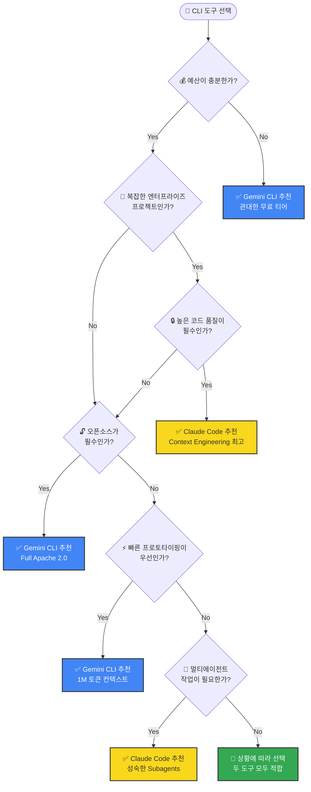

# Context Engineering 관점 CLI 도구 비교 분석 보고서

**작성일**: 2026년 1월 28일
**분석 대상**: Claude Code CLI vs Gemini CLI
**분석 관점**: Context Engineering 기능 완성도, 성숙도, 발전 방향
**보고서 유형**: PDCA Analysis Report

---

## 🎯 핵심 요약 (TL;DR)

### 한 문장 결론
> **Claude Code CLI**는 토큰 효율성과 정교한 Context Engineering으로 **품질 중심의 엔터프라이즈 개발**에 적합하고, **Gemini CLI**는 대용량 컨텍스트와 오픈소스 생태계로 **접근성 중심의 빠른 개발**에 적합합니다.

### 핵심 수치 비교

| 지표 | Claude Code CLI | Gemini CLI | 승자 |
|-----|----------------|------------|------|
| Context Window | ~200K tokens | **1M tokens** | 🏆 Gemini |
| Context Engineering 완성도 | **95%** | 80% | 🏆 Claude |
| Skills/Extensions 생태계 | **739+ skills** | Experimental | 🏆 Claude |
| GitHub Stars | 61.4K | **92.7K** | 🏆 Gemini |
| 토큰 효율성 | **46.9% 절감** (Tool Search) | 용량 의존 | 🏆 Claude |
| 오픈소스 | Partial | **Full Apache 2.0** | 🏆 Gemini |
| 무료 사용 | 제한적 | **60 req/min, 1000/day** | 🏆 Gemini |

### 핵심 차별화 요소

| 구분 | Claude Code CLI | Gemini CLI |
|-----|----------------|------------|
| **전략 철학** | "적은 토큰으로 많은 일" | "넉넉한 토큰으로 전체 로드" |
| **Context 관리** | Progressive Disclosure | 1M Token Window |
| **초기 로딩** | 메타데이터 ~100 토큰만 | 전체 프로젝트 로드 가능 |
| **도구 로딩** | 동적 온디맨드 로딩 | 세션 시작 시 전체 로드 |
| **효율성 기술** | Tool Search (46.9% 토큰 절감) | Conductor (영구 파일 저장) |
| **안전장치** | Hooks 기반 자동화 | Checkpointing 내장 |
| **멀티에이전트** | 내장 Subagents (Explore, Plan 등) | 제한적 (실험적) |
| **확장 시스템** | Skills + Plugins (739+ 성숙) | Agent Skills (Experimental) |

### 선택 가이드 (Quick Decision)

| 상황 | 추천 도구 |
|-----|----------|
| 엔터프라이즈 대규모 프로젝트 | **Claude Code CLI** |
| 개인 개발자 / 스타트업 | **Gemini CLI** |
| 오픈소스 필수 환경 | **Gemini CLI** |
| 높은 코드 품질 요구 | **Claude Code CLI** |
| 빠른 프로토타이핑 | **Gemini CLI** |
| 복잡한 멀티에이전트 작업 | **Claude Code CLI** |
| 예산 제한 | **Gemini CLI** |

### 발전 방향 키워드

| Claude Code CLI | Gemini CLI |
|----------------|------------|
| Swarming, Physical AI, 자율성 확대 | Agent Skills GA, Conductor 안정화, Google Cloud 통합 |

---

## 📋 Executive Summary

본 보고서는 2026년 1월 기준 두 주요 AI 코딩 CLI 도구인 **Claude Code CLI** (Anthropic)와 **Gemini CLI** (Google)의 Context Engineering 관점에서의 기능 구현 완성도, 성숙도, 그리고 추구하는 발전 방향을 심층 분석한 결과입니다.

### 핵심 결론

| 평가 항목 | Claude Code CLI | Gemini CLI |
|----------|----------------|------------|
| **Context Engineering 완성도** | ⭐⭐⭐⭐⭐ (95%) | ⭐⭐⭐⭐ (80%) |
| **생태계 성숙도** | ⭐⭐⭐⭐⭐ (92%) | ⭐⭐⭐⭐ (75%) |
| **커뮤니티 활성도** | 61.4K GitHub Stars | 92.7K GitHub Stars |
| **확장성 아키텍처** | Mature & Stable | Rapid Evolution |
| **오픈소스 여부** | Partial (Core closed) | Full Apache 2.0 |

---

## 1. 조사 배경 및 목적

### 1.1 Context Engineering의 정의

> "Context Engineering is the discipline of designing a system that provides the right information and tools, in the right format, to give an LLM everything it needs to accomplish a task."

Context Engineering은 단순한 프롬프트 엔지니어링을 넘어, AI 에이전트가 작업을 성공적으로 수행하기 위해 필요한 **적절한 정보와 도구를 적절한 형식으로 제공하는 시스템 설계 원칙**입니다.

### 1.2 평가 기준

본 보고서에서 사용한 Context Engineering 평가 기준:

1. **Context Window 관리**: 컨텍스트 윈도우 최적화 전략
2. **Progressive Disclosure**: 점진적 정보 로딩 메커니즘
3. **Memory System**: 영구적 메모리 및 프로젝트 컨텍스트 관리
4. **Tool Integration**: 외부 도구 연동 (MCP 등)
5. **Agent Architecture**: 서브에이전트 및 멀티에이전트 지원
6. **Extensibility**: 확장 시스템 (Skills, Plugins, Extensions)
7. **Safety & Sandboxing**: 안전한 실행 환경

---

## 2. Claude Code CLI 심층 분석

### 2.1 기본 정보

| 항목 | 내용 |
|-----|------|
| **개발사** | Anthropic |
| **최신 버전** | v2.1.1 (2026년 1월 8일) |
| **GitHub Stars** | 61.4K |
| **라이선스** | Proprietary (일부 오픈소스) |
| **Context Window** | ~200K tokens |
| **모델** | Claude Sonnet 4, Claude Opus 4.5 |

### 2.2 Context Engineering 핵심 기능

#### 2.2.1 CLAUDE.md 시스템 ⭐⭐⭐⭐⭐

CLAUDE.md는 Claude Code의 "헌법(Constitution)"으로 불리며, 프로젝트별 지침과 컨텍스트를 제공하는 핵심 메커니즘입니다.

**계층적 로딩 구조:**
```
~/.claude/CLAUDE.md          (글로벌 설정)
├── project-root/CLAUDE.md   (프로젝트 루트)
└── project-root/src/CLAUDE.md (하위 디렉토리)
```

**특징:**
- 계층적 병합으로 컨텍스트 상속
- 프로젝트별 코딩 표준 정의
- 자동 로딩 및 캐싱

#### 2.2.2 Skills & Plugins System ⭐⭐⭐⭐⭐

Claude Code의 Skills 시스템은 **Progressive Disclosure 패턴**을 완벽히 구현합니다.

**Progressive Disclosure 아키텍처:**
```
1. Metadata Loading (~100 tokens): 사용 가능한 Skills 스캔
2. Full Instructions (<5K tokens): 관련 Skill 확인 시 로드
3. Bundled Resources: 필요할 때만 파일/코드 로드
```

**Skill 구조:**
```yaml
# .claude/skills/my-skill/SKILL.md
---
name: my-skill
description: 스킬 설명
user-invocable: true
---
스킬 상세 지침...
```

**2026년 현황:**
- 739개 이상의 검증된 Skills
- 12개 SaaS Skill Packs (288 skills)
- agentskills 스펙 기반 크로스플랫폼 호환

#### 2.2.3 MCP (Model Context Protocol) ⭐⭐⭐⭐⭐

MCP는 Anthropic이 주도하는 **AI-도구 통합을 위한 오픈 표준**입니다.

**주요 특징:**
- Claude Code는 MCP 서버이자 클라이언트로 동작
- 2026년 1월 Tool Search 기능 추가 (46.9% 토큰 절감)
- 동적 온디맨드 도구 로딩
- 10,000+ 토큰 출력 시 경고 시스템

**MCP Apps (2026년 1월 26일 출시):**
- Asana, Box, Canva, Figma, Slack 등 직접 통합
- Claude 인터페이스 내에서 외부 앱 조작 가능

#### 2.2.4 Subagents & Multi-Agent Orchestration ⭐⭐⭐⭐⭐

**내장 서브에이전트:**
| 에이전트 | 역할 | 특징 |
|---------|------|------|
| Explore | 코드베이스 탐색 | 읽기 전용, 빠른 검색 |
| Plan | 계획 수립 | 컨텍스트 수집 후 계획 제시 |
| General-purpose | 복잡한 작업 | 탐색 + 실행 모두 가능 |

**Task Tool 오케스트레이션:**
- 병렬 서브에이전트 실행
- 격리된 컨텍스트 윈도우
- 관련 정보만 오케스트레이터에게 반환

#### 2.2.5 Plan Mode & Think Mode ⭐⭐⭐⭐⭐

**Plan Mode:**
- `Shift+Tab+Tab`으로 활성화
- 읽기 전용 코드베이스 분석
- 변경 전 계획 수립 및 검토

**Think Mode 레벨:**
```
"think" < "think hard" < "think harder" < "ultrathink"
```
- 각 레벨별 thinking budget 증가
- 최대 31,999 토큰까지 추론 공간 제공

#### 2.2.6 Hooks System ⭐⭐⭐⭐

**이벤트 기반 자동화:**
```json
{
  "hooks": {
    "PostToolUse": [{
      "matcher": "Edit",
      "command": "npm run format"
    }]
  }
}
```

**지원 Hook 유형:**
- PreToolUse / PostToolUse
- Setup (2026년 1월 추가)
- Stop / SubagentStop (프롬프트 기반)

### 2.3 Claude Code 발전 로드맵 (2026)

| 기능 | 상태 | 설명 |
|-----|------|------|
| Long-running Tasks | 예정 | 장시간 실행 작업 지원 |
| Swarming | 예정 | 다중 에이전트 협업 |
| Physical AI | 연구 중 | 로봇/자율주행 통합 |
| Claude in Chrome | Beta | 브라우저 자동화 |

---

## 3. Gemini CLI 심층 분석

### 3.1 기본 정보

| 항목 | 내용 |
|-----|------|
| **개발사** | Google |
| **최신 버전** | v0.26.0-preview.4 |
| **GitHub Stars** | 92.7K |
| **라이선스** | Apache 2.0 (완전 오픈소스) |
| **Context Window** | 1M tokens |
| **모델** | Gemini 3 |

### 3.2 Context Engineering 핵심 기능

#### 3.2.1 GEMINI.md 시스템 ⭐⭐⭐⭐

GEMINI.md는 Claude의 CLAUDE.md와 유사한 계층적 컨텍스트 시스템입니다.

**계층 구조:**
```
~/.gemini/GEMINI.md          (글로벌)
├── project-root/GEMINI.md   (프로젝트 루트)
└── subdirectory/GEMINI.md   (하위 디렉토리)
```

**특징:**
- .gitignore / .geminiignore 존중
- 모듈화 지원 (`@file.md` 문법으로 import)
- `/memory` 명령어로 실시간 관리

**Memory 명령어:**
```bash
/memory show    # 현재 컨텍스트 표시
/memory refresh # 재스캔
/memory add <text>  # 글로벌 메모리에 추가
```

#### 3.2.2 Conductor Extension ⭐⭐⭐⭐

Conductor는 2025년 12월 출시된 **Context-Driven Development** 확장입니다.

**핵심 철학:**
> "Control your code. Instead of diving straight into implementation, Conductor helps you formalize your intent."

**워크플로우:**
```
Context → Spec & Plan → Implement
```

**생성 파일 구조:**
```
conductor/
├── product.md
├── product-guidelines.md
├── tech-stack.md
├── workflow.md
├── tracks.md
└── [track-name]/
    ├── spec.md
    └── plan.md
```

**장점:**
- 영구적 Markdown 파일로 컨텍스트 저장
- 팀 전체 설정 공유 가능
- Plan 승인 후 구현 진행

#### 3.2.3 MCP Integration ⭐⭐⭐⭐

Gemini CLI도 MCP를 완전히 지원합니다.

**특징:**
- FastMCP v2.12.3 통합
- Google Cloud MCP 서버 (관리형)
- 리치 콘텐츠 응답 (텍스트, 이미지, 오디오)

**Google Workspace Extensions:**
- AlloyDB, BigQuery, Cloud SQL
- Dataplex, Firestore, Looker

#### 3.2.4 Agent Skills (Experimental) ⭐⭐⭐

2026년 1월 7일 v0.23.0에서 프리뷰로 출시된 실험적 기능입니다.

**Skills 유형:**
| 유형 | 위치 | 우선순위 |
|-----|------|---------|
| Workspace | .gemini/skills/ | 1 (최고) |
| User | ~/.gemini/skills/ | 2 |
| Extension | 설치된 확장 | 3 (최저) |

**활성화 방식:**
1. 세션 시작 시 모든 Skills 메타데이터 로드
2. Gemini가 작업에 맞는 Skill 식별
3. `activate_skill` 도구 호출
4. 사용자 승인 프롬프트

**현재 한계:**
- 실험적 기능 (experimental.skills 활성화 필요)
- Claude Code Skills 대비 생태계 미성숙

#### 3.2.5 Checkpointing System ⭐⭐⭐⭐

**자동 스냅샷 기능:**
- 파일 수정 전 자동 체크포인트 생성
- Shadow Git 저장소 (~/.gemini/history/)
- 대화 기록 포함

**복원:**
```bash
/restore  # 체크포인트 관리
```

#### 3.2.6 Sandbox System ⭐⭐⭐⭐

**지원 방식:**
| 방식 | 플랫폼 | 설명 |
|-----|--------|------|
| macOS Seatbelt | macOS | 내장 sandbox-exec |
| Docker | All | 컨테이너 격리 |
| Podman | All | 컨테이너 격리 |

### 3.3 Gemini CLI 발전 로드맵 (2026)

| 기능 | 상태 | 설명 |
|-----|------|------|
| Gemini 3 Model | 출시됨 | 향상된 추론 능력 |
| Agent Skills | Preview | 전문 지식 확장 |
| Conductor | Preview | Context-Driven Development |
| Google Cloud MCP | GA | 관리형 MCP 서버 |

---

## 4. 비교 분석

### 4.1 Context Engineering 기능 상세 비교

| 기능 | Claude Code | Gemini CLI | 비고 |
|-----|-------------|------------|------|
| **Context Window** | ~200K | 1M | Gemini 우위 |
| **Memory System** | CLAUDE.md | GEMINI.md | 동등 |
| **Progressive Disclosure** | ✅ 완전 지원 | ⚠️ 부분 지원 | Claude 우위 |
| **Skills System** | 739+ skills | Experimental | Claude 우위 |
| **Plugins** | ✅ Mature | ⚠️ Extensions | Claude 우위 |
| **MCP Support** | ✅ 완전 (Tool Search) | ✅ 완전 | 동등 |
| **Multi-Agent** | ✅ 내장 | ⚠️ 제한적 | Claude 우위 |
| **Plan Mode** | ✅ 완전 | ✅ Conductor | 동등 (접근 다름) |
| **Think Mode** | ✅ 4단계 | ❌ 없음 | Claude 우위 |
| **Checkpointing** | ❌ 없음 | ✅ 내장 | Gemini 우위 |
| **Sandbox** | ⚠️ 제한적 | ✅ 다양한 옵션 | Gemini 우위 |
| **Hooks** | ✅ 완전 | ⚠️ 제한적 | Claude 우위 |

### 4.2 아키텍처 철학 비교

#### Claude Code: "Constitution-Driven Agent"
```
CLAUDE.md (헌법)
    ↓
Skills (전문 지식)
    ↓
Subagents (분업)
    ↓
MCP (외부 도구)
```
- **중앙화된 컨텍스트 관리**
- **점진적 정보 공개 (Progressive Disclosure)**
- **토큰 효율성 최우선**

#### Gemini CLI: "Context-Driven Development"
```
GEMINI.md (기본 컨텍스트)
    ↓
Conductor (사양/계획)
    ↓
Skills (실험적)
    ↓
MCP (확장)
```
- **대용량 컨텍스트 윈도우 활용**
- **영구적 파일 기반 상태 관리**
- **오픈소스 중심 생태계**

### 4.3 성숙도 평가

#### Context Engineering 성숙도 모델

```
Level 1: Basic Context (단순 프롬프트)
Level 2: Structured Context (설정 파일)
Level 3: Dynamic Context (동적 로딩)
Level 4: Progressive Context (점진적 공개)
Level 5: Orchestrated Context (멀티에이전트)
```

| 도구 | 현재 레벨 | 목표 레벨 |
|-----|----------|----------|
| Claude Code | Level 5 | Level 5+ |
| Gemini CLI | Level 3-4 | Level 5 |

### 4.4 토큰 효율성 분석

#### Claude Code
- MCP Tool Search: 46.9% 토큰 절감 (51K → 8.5K)
- Skills Progressive Disclosure: 메타데이터 ~100 토큰
- Context Compacting: 자동 요약으로 중복 제거

#### Gemini CLI
- 1M 토큰 윈도우로 전체 프로젝트 로드 가능
- Conductor: 토큰 소비 증가 경고
- 효율성보다 용량에 의존

### 4.5 개발자 경험 (DX) 비교

| 항목 | Claude Code | Gemini CLI |
|-----|-------------|------------|
| 설치 | 간편 (brew, npm) | 간편 (npm) |
| 설정 | 다소 복잡 | 간단 |
| 학습 곡선 | 중간-높음 | 낮음-중간 |
| 문서화 | 우수 | 우수 |
| 커뮤니티 | 활발 | 매우 활발 |
| 비용 | Pro/Max 구독 필요 | 관대한 무료 티어 |

---

## 5. 발전 방향 분석

### 5.1 Claude Code 발전 방향

#### 단기 (2026 Q1-Q2)
1. **Claude in Chrome 정식 출시**: 브라우저 자동화 완성
2. **Long-running Tasks**: 장시간 작업 안정성 강화
3. **Swarming**: 다중 에이전트 협업 시스템

#### 중장기 (2026 H2+)
1. **Physical AI**: 로봇/IoT 통합
2. **Enterprise Features**: 팀 협업 강화
3. **자율성 확대**: 더 독립적인 작업 수행

#### 전략적 방향
> "More agentic, more autonomous, more capable"

Claude Code는 **토큰 효율성과 정교한 컨텍스트 관리**를 통해 제한된 컨텍스트 윈도우를 최대한 활용하는 방향으로 발전 중입니다.

### 5.2 Gemini CLI 발전 방향

#### 단기 (2026 Q1-Q2)
1. **Agent Skills GA**: 실험적 기능 정식 출시
2. **Conductor 안정화**: Context-Driven Development 완성
3. **Gemini 3 최적화**: 새 모델 기능 활용

#### 중장기 (2026 H2+)
1. **Google Cloud 통합 강화**: 엔터프라이즈 기능
2. **오픈소스 생태계 확대**: 커뮤니티 중심 성장
3. **멀티모달 강화**: 이미지/오디오 처리

#### 전략적 방향
> "Open-source first, large context, Google ecosystem"

Gemini CLI는 **대용량 컨텍스트 윈도우와 오픈소스 생태계**를 활용하여 접근성과 확장성을 강조하는 방향으로 발전 중입니다.

---

## 6. 결론 및 제언

### 6.1 종합 평가

#### 강점/약점 비교표

| 평가 항목 | Claude Code CLI | Gemini CLI |
|----------|----------------|------------|
| **강점 1** | Context Engineering 완성도 최고 수준 | 완전 오픈소스 (Apache 2.0) |
| **강점 2** | Progressive Disclosure 완벽 구현 | 1M 토큰 대용량 컨텍스트 |
| **강점 3** | 멀티에이전트 아키텍처 성숙 | 관대한 무료 티어 (60 req/min) |
| **강점 4** | 토큰 효율성 최적화 (46.9% 절감) | 빠른 개발 속도 |
| **약점 1** | Closed-source 코어 | Skills 시스템 미성숙 (Experimental) |
| **약점 2** | 유료 구독 필수 (Pro/Max) | Progressive Disclosure 부족 |
| **약점 3** | 컨텍스트 윈도우 상대적 제한 (~200K) | Context 효율성 낮음 (용량 의존) |

#### 적합 대상 비교표

| 사용 시나리오 | Claude Code CLI | Gemini CLI |
|-------------|----------------|------------|
| **엔터프라이즈 개발** | ✅ 최적 | ⚠️ 가능 |
| **복잡한 대규모 프로젝트** | ✅ 최적 | ⚠️ 가능 |
| **높은 코드 품질 요구** | ✅ 최적 | ⚠️ 가능 |
| **개인 개발자/스타트업** | ⚠️ 비용 부담 | ✅ 최적 |
| **빠른 프로토타이핑** | ⚠️ 가능 | ✅ 최적 |
| **오픈소스 선호 환경** | ❌ 제한적 | ✅ 최적 |
| **예산 제한 환경** | ❌ 불리 | ✅ 최적 |
| **멀티에이전트 복잡 작업** | ✅ 최적 | ⚠️ 제한적 |

#### 총점 비교

| 평가 영역 | Claude Code CLI | Gemini CLI |
|----------|----------------|------------|
| Context Engineering 완성도 | ⭐⭐⭐⭐⭐ (95%) | ⭐⭐⭐⭐ (80%) |
| 생태계 성숙도 | ⭐⭐⭐⭐⭐ (92%) | ⭐⭐⭐⭐ (75%) |
| 개발자 경험 (DX) | ⭐⭐⭐⭐ (85%) | ⭐⭐⭐⭐⭐ (90%) |
| 비용 효율성 | ⭐⭐⭐ (60%) | ⭐⭐⭐⭐⭐ (95%) |
| 확장성/유연성 | ⭐⭐⭐⭐⭐ (90%) | ⭐⭐⭐⭐ (80%) |
| **종합 평가** | **⭐⭐⭐⭐⭐ (88%)** | **⭐⭐⭐⭐ (84%)** |

### 6.2 선택 가이드



#### 선택 요약표

| 우선순위 | 추천 도구 | 핵심 이유 |
|---------|----------|----------|
| 예산 제한 | Gemini CLI | 60 req/min, 1000/day 무료 |
| 엔터프라이즈 + 고품질 | Claude Code | Context Engineering 95% |
| 오픈소스 필수 | Gemini CLI | Full Apache 2.0 |
| 빠른 프로토타이핑 | Gemini CLI | 1M 토큰 컨텍스트 |
| 멀티에이전트 복잡 작업 | Claude Code | 내장 Subagents |
| 특별한 요구사항 없음 | 둘 다 적합 | 개인 선호에 따라 |

### 6.3 미래 전망

2026년 Context Engineering 분야는 다음과 같은 방향으로 발전할 것으로 예상됩니다:

1. **Context as First-Class Citizen**: 컨텍스트를 1급 시민으로 취급하는 아키텍처
2. **KV-Cache 최적화**: 캐시 히트율이 핵심 성능 지표로 부상
3. **Hybrid Approach**: 대규모 컨텍스트 + 효율적 관리의 결합
4. **MCP 표준화**: Linux Foundation 아래 통합 표준 확립

---

## 7. 참고 자료

### 7.1 공식 문서

**Claude Code:**
- [Claude Code Overview](https://code.claude.com/docs/en/overview)
- [GitHub Repository](https://github.com/anthropics/claude-code)
- [Best Practices](https://www.anthropic.com/engineering/claude-code-best-practices)

**Gemini CLI:**
- [Gemini CLI Documentation](https://geminicli.com/docs/)
- [GitHub Repository](https://github.com/google-gemini/gemini-cli)
- [Conductor Extension](https://github.com/gemini-cli-extensions/conductor)

### 7.2 기술 블로그

- [Context Engineering for AI Agents (Anthropic)](https://www.anthropic.com/engineering/effective-context-engineering-for-ai-agents)
- [Context Engineering for AI Agents (Manus)](https://manus.im/blog/Context-Engineering-for-AI-Agents-Lessons-from-Building-Manus)
- [Conductor: Context-Driven Development (Google)](https://developers.googleblog.com/conductor-introducing-context-driven-development-for-gemini-cli/)

### 7.3 비교 분석 자료

- [Claude Code vs Gemini CLI (Shipyard)](https://shipyard.build/blog/claude-code-vs-gemini-cli/)
- [Claude Code vs Gemini CLI (Composio)](https://composio.dev/blog/gemini-cli-vs-claude-code-the-better-coding-agent)

---

## 8. 부록

### 8.1 용어 정의

| 용어 | 정의 |
|-----|------|
| Context Engineering | LLM이 작업을 수행하는 데 필요한 정보와 도구를 적절히 제공하는 시스템 설계 |
| Progressive Disclosure | 필요한 정보만 점진적으로 로딩하는 패턴 |
| MCP | Model Context Protocol, AI-도구 통합 오픈 표준 |
| KV-Cache | Key-Value Cache, LLM 추론 최적화 메커니즘 |
| Context Rot | 컨텍스트 윈도우가 채워질수록 성능이 저하되는 현상 |

### 8.2 평가 방법론

본 보고서는 다음 자료를 기반으로 작성되었습니다:
- 공식 문서 분석
- GitHub 리포지토리 및 이슈 분석
- 기술 블로그 및 발표 자료
- 커뮤니티 피드백 및 비교 분석 자료

---

**보고서 작성**: bkit PDCA Report Generator
**분석 일자**: 2026년 1월 28일
**버전**: 1.0
