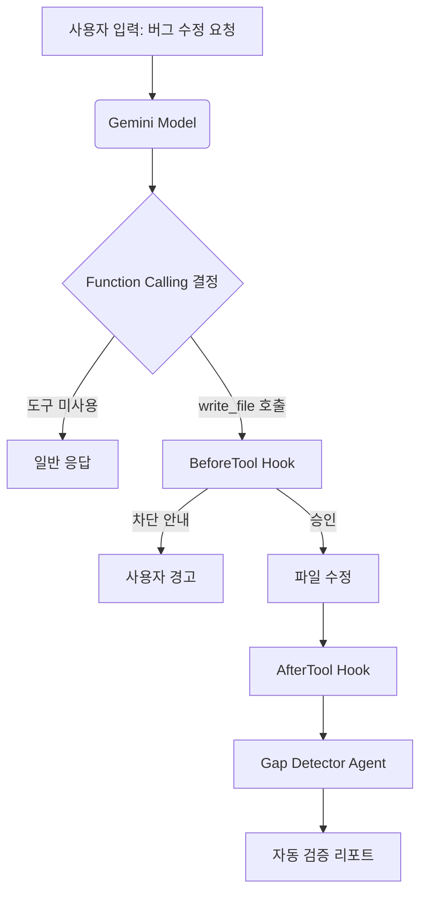

# Gemini CLI 자동화 및 Hooks 심층 분석

> **분석 일자**: 2026-01-24
> **분석 대상**: Gemini CLI Extension Architecture & bkit Integration
> **참조 문서**: Gemini Official API Docs, Gemini CLI GitHub Issues, bkit Codebase

---

## 1. 개요: Gemini CLI와 자동화의 만남

사용자가 "Gemini CLI"를 사용할 때, 단순한 채팅을 넘어선 **자율 에이전트(Autonomous Agent)**로서의 행동을 가능하게 하는 핵심 기술은 **Function Calling(도구 호출)**과 **Hooks(이벤트 가로채기)**의 결합입니다.

본 문서는 `bkit`이 어떻게 이 두 가지 기술을 결합하여, 사용자가 명시적인 명령어를 입력하지 않아도 자연어 대화만으로 PDCA 개발 방법론을 강제하고 자동화하는지 분석합니다.

---

## 2. Gemini CLI Extension 아키텍처

Gemini CLI의 확장 시스템은 **이벤트 기반(Event-Driven)** 아키텍처를 따릅니다. 이는 Claude Code의 플러그인 시스템과 유사하지만, 몇 가지 독자적인 특징을 가집니다.

### 2.1 Hooks 시스템 구조 (`gemini-extension.json`)

`bkit`은 Gemini CLI의 다음과 같은 Hook 포인트를 활용합니다:

| Hook Point | Trigger 시점 | bkit 활용 (Script) | 역할 |
|------------|-------------|-------------------|------|
| **SessionStart** | 세션 시작 직후 | `hooks/session-start.js` | 사용자 온보딩, 환경 감지, 프로젝트 상태 초기화 |
| **BeforeTool** | 도구 실행 직전 | `scripts/pre-write.js` | **Do 단계 통제**: 설계 문서 존재 여부 확인, 컨벤션 준수 강제 |
| **BeforeTool** | 쉘 명령 실행 전 | `scripts/qa-pre-bash.js` | **위험 통제**: 파괴적인 명령어(rm -rf 등) 차단 |
| **AfterTool** | 파일 쓰기 직후 | `scripts/pdca-post-write.js` | **Check 단계 자동화**: 변경된 코드에 대한 Gap Analysis 자동 제안 |
| **AfterTool** | 쉘/쓰기 직후 | `scripts/qa-monitor-post.js` | **QA 모니터링**: 에러 로그 발생 시 자동 감지 |

### 2.2 설정 파일 분석

`gemini-extension.json` 파일은 이 연결을 정의하는 핵심 설정입니다:

```json
"hooks": {
  "BeforeTool": [
    {
      "matcher": "write_file|replace",
      "command": "node ${extensionPath}/scripts/pre-write.js",
      "timeout": 5000
    }
  ],
  "AfterTool": [
    {
      "matcher": "write_file",
      "command": "node ${extensionPath}/scripts/pdca-post-write.js"
    }
  ]
}
```

**핵심 매커니즘**:
1. 사용자가 "로그인 기능 구현해줘"라고 요청.
2. Gemini 모델이 `write_file` 도구를 호출하기로 결정 (Function Calling).
3. **BeforeTool Hook 발동**: `pre-write.js`가 실행되어 "로그인 설계 문서가 없습니다. 먼저 작성하시겠습니까?"라고 개입 가능.
4. **AfterTool Hook 발동**: 파일이 작성된 후 `pdca-post-write.js`가 실행되어 "구현이 완료되었습니다. 검증(Gap Analysis)을 진행할까요?"라고 자동 제안.

---

## 3. 자연어 트리거와 Function Calling

Gemini API의 **Function Calling** 기능은 사용자의 자연어를 도구 실행으로 변환하는 엔진입니다. `bkit`은 이 엔진 위에 **"의도 파악(Intent Recognition)"** 레이어를 덧입혔습니다.

### 3.1 자동 트리거 흐름



### 3.2 주요 자연어 트리거 패턴

사용자가 굳이 `/command`를 몰라도, 다음과 같은 자연어 패턴이 내부적으로 자동화된 워크플로우를 트리거합니다.

1.  **"검증해줘", "확인해줘" (Verify/Check)**
    *   → `gap-detector` Agent 자동 활성화
    *   → 설계 문서와 코드 간의 일치율 분석

2.  **"코드 품질 봐줘" (Analyze Code)**
    *   → `code-analyzer` Agent 활성화
    *   → 복잡도, 보안 취약점 스캔

3.  **"테스트 해줘" (Test/QA)**
    *   → `qa-monitor` Agent 활성화
    *   → Docker 로그 분석 및 에러 원인 추적

---

## 4. Gemini CLI 이슈 및 한계점 (GitHub Research)

Gemini CLI 커뮤니티(GitHub Issues)에서 논의되는 확장 기능 관련 주요 이슈와 `bkit`의 대응 현황입니다.

### 4.1 표준 출력 오염 (Stdout Pollution)
*   **이슈**: Hook 스크립트가 `console.log`로 불필요한 텍스트를 출력하면, CLI가 JSON 응답을 파싱하지 못해 에러가 발생함.
*   **bkit 대응**: 모든 Hook 스크립트(`scripts/*.js`)는 사용자에게 보여줄 메시지만을 정해진 포맷으로 출력하거나, `stderr`를 사용하여 디버그 로그를 남기도록 엄격히 코딩됨.

### 4.2 타임아웃 (Timeouts)
*   **이슈**: Hook 실행 시간이 길어지면(기본 1분) CLI가 강제 종료함.
*   **bkit 대응**: 무거운 분석 작업(Gap Analysis 등)은 Hook 내부에서 직접 실행하지 않고, **"제안(Suggestion)"** 메시지만 남기고 종료하여 사용자가 후속 조치를 승인하게 유도함 (Non-blocking 방식).

### 4.3 보안 (Security)
*   **이슈**: 프로젝트 레벨의 Hook이 사용자 몰래 악성 스크립트를 실행할 위험.
*   **bkit 대응**: `qa-pre-bash.js`를 통해 `rm -rf`, `DROP TABLE`과 같은 파괴적인 명령어 패턴을 감지하고 차단하는 방어 로직 내장.

---

## 5. 결론: "명령어 없는 개발"의 실현

Gemini CLI 환경에서 `bkit`은 단순한 도구 모음이 아닙니다. `gemini-extension.json`에 정의된 Hooks 시스템을 통해, **AI가 개발자의 행동을 감시하고(Monitor), 가이드하며(Guide), 자동으로 후속 조치를 제안(Suggest)**하는 **능동형 파트너**로 동작합니다.

사용자는 복잡한 `bkit` 명령어(`/pdca-analyze` 등)를 외울 필요 없이, **"만들고(Do)", "고치라(Fix)"는 자연어 대화**만으로도 엔터프라이즈급 소프트웨어 개발 프로세스(PDCA)를 준수하게 됩니다.
