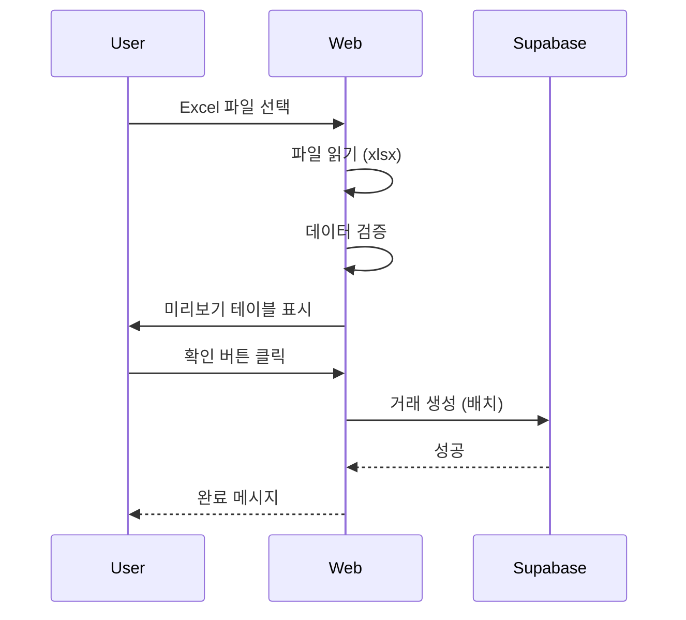

# 웹 통계 플랫폼 - 상세 기능 명세

## 1. 차트 종류 및 상세 스펙

### 1.1 월별 수입/지출 추이 (Line Chart)

#### 데이터 구조
```typescript
interface MonthlyTrendData {
  month: string;        // '2025-01'
  income: number;       // 수입
  expense: number;      // 지출
  saving: number;       // 저축
  balance: number;      // 잔액 (수입 - 지출)
}
```

#### 차트 옵션
```typescript
{
  // X축: 월 (MM월)
  // Y축: 금액 (원)
  lines: [
    { dataKey: 'income', stroke: '#2E7D32', name: '수입' },
    { dataKey: 'expense', stroke: '#BA1A1A', name: '지출' },
    { dataKey: 'saving', stroke: '#006A6A', name: '저축' },
  ],
  showAverage: true,     // 평균선 표시
  showTooltip: true,     // 호버 시 상세 정보
  responsive: true,
}
```

#### 필터
- 기간: 6개월 / 1년 / 전체
- 거래 유형: 전체 / 수입 / 지출 / 저축
- 사용자: 전체 / 특정 사용자 (공유 가계부)

---

### 1.2 카테고리별 지출 분석 (Donut Chart)

#### 데이터 구조
```typescript
interface CategoryData {
  categoryId: string;
  categoryName: string;
  categoryIcon: string;
  categoryColor: string;
  amount: number;
  percentage: number;
}
```

#### 차트 옵션
```typescript
{
  innerRadius: '60%',
  outerRadius: '80%',
  showLabel: true,        // 퍼센트 표시
  showLegend: true,       // 범례
  maxCategories: 5,       // 상위 5개 + 기타
  colors: 'category',     // 카테고리 색상 사용
}
```

#### 사용자별 비교 모드
- 나란히 보기 (Side by Side): 2개 도넛 차트
- 겹쳐서 보기 (Overlay): 반투명 레이어
- 합쳐서 보기 (Combined): 단일 차트

---

### 1.3 결제수단별 사용 현황 (Horizontal Bar Chart)

#### 데이터 구조
```typescript
interface PaymentMethodData {
  paymentMethodId: string;
  paymentMethodName: string;
  paymentMethodIcon: string;
  paymentMethodColor: string;
  amount: number;
  percentage: number;
  canAutoSave: boolean;  // 자동수집 지원 여부
}
```

#### 차트 옵션
```typescript
{
  layout: 'horizontal',
  bars: [
    { dataKey: 'amount', fill: 'paymentMethodColor' },
  ],
  showPercentage: true,
  showIcon: true,         // 결제수단 아이콘 표시
  sortBy: 'amount',       // 금액순 정렬
}
```

---

### 1.4 사용자별 지출 비교 (Stacked Bar Chart)

#### 데이터 구조
```typescript
interface UserComparisonData {
  month: string;          // '2025-01'
  users: {
    [userId: string]: {
      userName: string;
      userColor: string;
      amount: number;
    }
  };
}
```

#### 차트 옵션
```typescript
{
  layout: 'vertical',
  stacked: true,
  bars: userList.map(user => ({
    dataKey: user.userId,
    fill: user.userColor,
    name: user.userName,
  })),
}
```

---

### 1.5 예산 진행률 (Progress Chart)

#### 데이터 구조
```typescript
interface BudgetProgressData {
  categoryId: string;
  categoryName: string;
  budgetAmount: number;     // 예산
  spentAmount: number;      // 지출
  percentage: number;       // 진행률
  isOverBudget: boolean;    // 예산 초과 여부
}
```

#### 차트 옵션
```typescript
{
  bars: [
    { dataKey: 'spentAmount', fill: 'dynamic' }, // 초과 시 빨강
  ],
  threshold: 100,           // 100% 기준선
  showWarning: true,        // 80% 이상 경고
  colors: {
    normal: '#2E7D32',
    warning: '#FF9800',
    danger: '#BA1A1A',
  },
}
```

---

### 1.6 연도별 추이 (Bar Chart)

#### 데이터 구조
```typescript
interface YearlyTrendData {
  year: number;             // 2025
  income: number;
  expense: number;
  saving: number;
  balance: number;
}
```

#### 차트 옵션
```typescript
{
  bars: [
    { dataKey: 'income', fill: '#2E7D32', name: '수입' },
    { dataKey: 'expense', fill: '#BA1A1A', name: '지출' },
  ],
  showLine: true,           // 잔액 추세선
  years: 3,                 // 최근 3년
}
```

---

## 2. 파일 임포트/익스포트 상세

### 2.1 Excel 업로드 플로우



### 2.2 데이터 검증 규칙

```typescript
interface ValidationRule {
  // 필수 필드
  required: ['날짜', '유형', '금액'];

  // 날짜 형식
  dateFormat: /^\d{4}-\d{2}-\d{2}$/;

  // 유형 값
  typeValues: ['수입', 'income', '지출', 'expense', '자산', 'asset'];

  // 금액 범위
  amountRange: {
    min: 1,
    max: 1000000000, // 10억
  };

  // 중복 체크
  duplicateCheck: {
    fields: ['date', 'amount', 'memo'],
    tolerance: 1000, // 같은 날짜, 같은 메모, 금액 차이 1000원 이내
  };
}
```

### 2.3 에러 처리

```typescript
interface UploadError {
  row: number;            // 행 번호
  field: string;          // 필드명
  value: any;             // 잘못된 값
  message: string;        // 에러 메시지
  severity: 'error' | 'warning';
}

// 예시
[
  {
    row: 5,
    field: '날짜',
    value: '2025/02/01',
    message: '날짜 형식이 올바르지 않습니다. YYYY-MM-DD 형식으로 입력하세요.',
    severity: 'error',
  },
  {
    row: 7,
    field: '카테고리',
    value: '기타',
    message: '카테고리가 존재하지 않습니다. 기본 카테고리로 저장됩니다.',
    severity: 'warning',
  },
]
```

### 2.4 Excel/CSV 다운로드 형식

#### 기본 템플릿
```
날짜 | 유형 | 카테고리 | 금액 | 메모 | 결제수단 | 사용자
```

#### 통계 포함 템플릿 (Excel만)
```
Sheet 1: 거래 내역
Sheet 2: 월별 요약
Sheet 3: 카테고리별 요약
Sheet 4: 결제수단별 요약
```

#### 다운로드 옵션
```typescript
interface DownloadOptions {
  format: 'excel' | 'csv';
  dateRange: {
    start: Date;
    end: Date;
  };
  includeStatistics: boolean;  // 통계 시트 포함 (Excel만)
  filters: {
    type?: 'income' | 'expense' | 'asset';
    categoryIds?: string[];
    userIds?: string[];
  };
}
```

---

## 3. 대시보드 레이아웃

### 3.1 데스크톱 (1280px+)

```
┌─────────────────────────────────────────────────┐
│ Header (NavBar)                                 │
├─────────────────────────────────────────────────┤
│                                                 │
│  ┌─────────┐  ┌─────────┐  ┌─────────┐        │
│  │ 수입    │  │ 지출    │  │ 저축    │        │
│  │ 카드    │  │ 카드    │  │ 카드    │        │
│  └─────────┘  └─────────┘  └─────────┘        │
│                                                 │
│  ┌─────────────────────────────────────────┐   │
│  │ 월별 추이 (Line Chart)                  │   │
│  │                                         │   │
│  └─────────────────────────────────────────┘   │
│                                                 │
│  ┌────────────────┐  ┌──────────────────────┐  │
│  │ 카테고리 분석  │  │ 최근 거래            │  │
│  │ (Donut Chart)  │  │ (Table)             │  │
│  └────────────────┘  └──────────────────────┘  │
│                                                 │
└─────────────────────────────────────────────────┘
```

### 3.2 모바일 (< 768px)

```
┌───────────────┐
│ Header        │
├───────────────┤
│ 수입 카드     │
│ 지출 카드     │
│ 저축 카드     │
├───────────────┤
│ 월별 추이     │
│ (Line Chart)  │
├───────────────┤
│ 카테고리 분석 │
│ (Donut Chart) │
├───────────────┤
│ 최근 거래     │
│ (Table)       │
└───────────────┘
```

---

## 4. 필터 및 검색 기능

### 4.1 필터 UI

```typescript
interface FilterState {
  // 기간
  dateRange: {
    start: Date;
    end: Date;
    preset?: '이번 달' | '지난 달' | '최근 3개월' | '최근 6개월' | '올해';
  };

  // 거래 유형
  type: 'all' | 'income' | 'expense' | 'asset';

  // 카테고리
  categoryIds: string[];

  // 사용자 (공유 가계부)
  userIds: string[];

  // 결제수단
  paymentMethodIds: string[];

  // 금액 범위
  amountRange?: {
    min: number;
    max: number;
  };

  // 고정비/변동비 (지출만)
  expenseType?: 'fixed' | 'variable' | 'all';
}
```

### 4.2 검색 기능

```typescript
interface SearchOptions {
  query: string;          // 메모 검색
  fields: ['memo', 'categoryName', 'paymentMethodName'];
  caseSensitive: false;
  fuzzy: true;            // 유사 검색
}
```

---

## 5. 반응형 디자인 브레이크포인트

```typescript
const breakpoints = {
  mobile: '(max-width: 767px)',
  tablet: '(min-width: 768px) and (max-width: 1023px)',
  desktop: '(min-width: 1024px)',
  largeDesktop: '(min-width: 1280px)',
};
```

### 컴포넌트별 반응형 동작

| 컴포넌트 | Mobile | Tablet | Desktop |
|---------|--------|--------|---------|
| 요약 카드 | 1열 | 2열 | 3열 |
| 차트 | 전체 너비 | 2열 | 2열 |
| 테이블 | 스크롤 | 전체 표시 | 전체 표시 |
| 사이드바 | 드로어 | 드로어 | 고정 |

---

## 6. 성능 최적화 전략

### 6.1 데이터 페칭
```typescript
// TanStack Query 캐싱
const queryClient = new QueryClient({
  defaultOptions: {
    queries: {
      staleTime: 1000 * 60 * 5,  // 5분
      cacheTime: 1000 * 60 * 30, // 30분
    },
  },
});
```

### 6.2 차트 렌더링 최적화
```typescript
// 데이터 샘플링 (너무 많은 데이터 포인트 방지)
function sampleData(data: any[], maxPoints: number = 100) {
  if (data.length <= maxPoints) return data;

  const step = Math.floor(data.length / maxPoints);
  return data.filter((_, i) => i % step === 0);
}
```

### 6.3 코드 스플리팅
```typescript
// 차트 컴포넌트 lazy load
const LineChart = lazy(() => import('@/components/charts/LineChart'));
const DonutChart = lazy(() => import('@/components/charts/DonutChart'));
```

---

## 7. 에러 처리 및 로딩 상태

### 7.1 에러 타입
```typescript
enum ErrorType {
  NETWORK_ERROR = 'NETWORK_ERROR',
  AUTH_ERROR = 'AUTH_ERROR',
  VALIDATION_ERROR = 'VALIDATION_ERROR',
  SERVER_ERROR = 'SERVER_ERROR',
  FILE_ERROR = 'FILE_ERROR',
}
```

### 7.2 로딩 상태
```typescript
interface LoadingState {
  isLoading: boolean;
  message?: string;
  progress?: number;  // 0-100
}

// 파일 업로드 시 프로그레스 바
<Progress value={progress} max={100} />
```

---

## 8. 접근성 (a11y)

### 8.1 필수 요구사항
- [ ] ARIA 라벨
- [ ] 키보드 네비게이션 (Tab, Enter, Space)
- [ ] 색상 대비 (WCAG AA: 4.5:1)
- [ ] 포커스 인디케이터
- [ ] 스크린 리더 지원

### 8.2 차트 접근성
```typescript
<LineChart
  aria-label="월별 수입/지출 추이 차트"
  role="img"
>
  <desc>
    2024년 8월부터 2025년 1월까지의 월별 수입과 지출 추이를 나타낸 꺾은선 그래프입니다.
  </desc>
</LineChart>
```

---

## 9. 테스트 전략

### 9.1 Unit Tests
```typescript
// 데이터 검증 함수
describe('validateExcelData', () => {
  it('should validate date format', () => {
    const result = validateDate('2025-02-01');
    expect(result.isValid).toBe(true);
  });

  it('should reject invalid date', () => {
    const result = validateDate('2025/02/01');
    expect(result.isValid).toBe(false);
  });
});
```

### 9.2 Integration Tests
```typescript
// 파일 업로드 플로우
describe('File Upload Flow', () => {
  it('should upload and save transactions', async () => {
    const file = new File([excelData], 'test.xlsx');
    const result = await uploadFile(file);
    expect(result.success).toBe(true);
    expect(result.rowCount).toBeGreaterThan(0);
  });
});
```

---

## 10. 배포 및 모니터링

### 10.1 Vercel 배포
```bash
# 환경 변수 설정
NEXT_PUBLIC_SUPABASE_URL=https://...
NEXT_PUBLIC_SUPABASE_ANON_KEY=...

# 배포
vercel --prod
```

### 10.2 모니터링
- Vercel Analytics (성능)
- Sentry (에러 추적)
- Supabase Logs (백엔드 로그)

---

## 11. 향후 확장 가능성

### 단기 (1개월 이내)
- [ ] PDF 리포트 생성
- [ ] 이메일 리포트 자동 발송
- [ ] 커스텀 차트 저장

### 중기 (3개월 이내)
- [ ] AI 기반 지출 예측
- [ ] 예산 자동 추천
- [ ] 이상 거래 감지

### 장기 (6개월 이내)
- [ ] 다중 가계부 비교
- [ ] 팀 협업 기능
- [ ] API 제공 (서드파티 통합)
